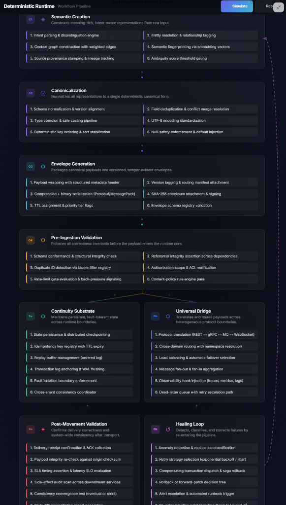

# Deterministic Runtime Pipeline — Detailed Wiring

The full stage-for-stage wiring of the Deterministic Runtime Pipeline: semantic creation → canonicalization → envelope generation → pre-ingestion validation → continuity substrate → universal bridge → healing loop → post-movement validation — the probabilistic mesh proposes, the deterministic layer validates, and execution is verifiable.

This diagram is the working architecture behind **US Provisional Application 64/157,915** (filed September 18, 2026 — see [DCAI Filing Record](../patents/DCAI_FILING_RECORD.md)). Published as timestamped prior art, per the open-book disclosure doctrine.

- Filing record + Specification: [`docs/patents/`](../patents/)
- Runtime Recipe Book (the full method): [`JASPER_RUNTIME_RECIPE_BOOK.md`](../../JASPER_RUNTIME_RECIPE_BOOK.md)
- Portfolio: 8 patents pending + 5 SBIR tracks

---

*This software is a prototype and is provided for educational and research purposes only. It is not intended for production use, commercial deployment, or safety-critical environments. All systems are experimental and may contain defects.*
